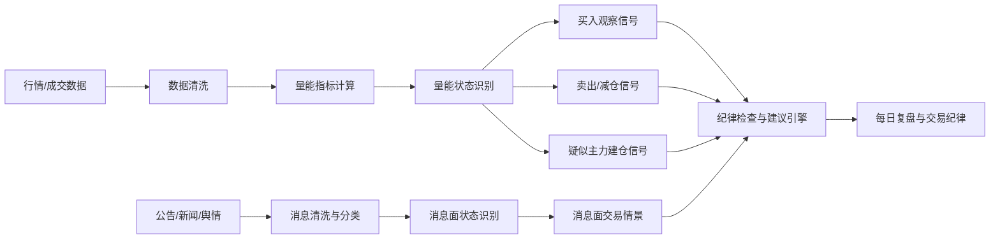
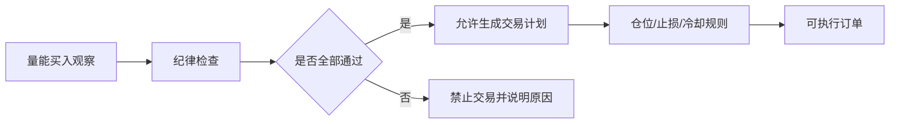

# 个人股票量能分析系统建设方案

版本日期：2026-07-03

## 1. 系统目标

本系统以股票“量能”为主线，结合每日消息面建立个人分析框架，用于辅助判断：

- 买入观察点：量能从低迷、压缩、分歧状态转向主动成交放大的位置。
- 卖出/减仓观察点：量能异常放大但承接不足、量价背离、换手过热或流动性快速衰减的位置。
- 主力建仓迹象：通过持续性成交、缩量抗跌、温和放量、换手结构和大单/主动买卖数据推断“疑似吸筹/建仓”状态。
- 消息面交易建议：结合公告、监管、行业、宏观、舆情和量能变化，识别恐慌性下跌、主力出货、主力洗盘、利好兑现、利空释放等情景。

重要边界：

- “主力建仓”不是公开可直接观测的数据，只能通过成交行为做概率推断。
- 单一量能信号或单条消息不能直接等同于买卖指令，必须结合风险控制、回测结果和交易纪律。
- 本文档是系统设计方案，不构成投资建议。

## 2. 需要准备的东西

### 2.1 数据

基础数据：

- 股票代码、名称、市场、行业、上市状态。
- 日线 OHLCV：开盘价、最高价、最低价、收盘价、成交量、成交额。
- 分钟线 OHLCV：1 分钟、5 分钟、15 分钟、30 分钟、60 分钟，用于盘中量能节奏。
- 换手率：总股本换手、流通股换手。
- 流通市值、自由流通股本，用于判断成交量是否真的有意义。
- 停复牌、除权除息、涨跌停状态，用于修正异常量能。

增强数据：

- Level-2 逐笔成交、逐笔委托、买卖队列。
- 主动买入额、主动卖出额、净主动买入额。
- 大单/超大单成交额、成交占比、连续性。
- 龙虎榜、大宗交易、融资融券余额变化。
- 板块指数和市场总成交额，用于过滤市场整体放量/缩量影响。

消息面数据：

- 公司公告：业绩预告、定期报告、重大合同、回购、减持、质押、重组、停复牌、风险警示。
- 交易所/监管：问询函、监管函、处罚、立案、退市风险、交易异常波动公告。
- 财经新闻：公司新闻、行业政策、产业链变化、宏观数据、市场快讯。
- 舆情数据：雪球、股吧、新闻评论等公开讨论热度和情绪倾向。
- 市场情绪：涨跌停家数、炸板率、连板高度、板块成交额、指数成交额、北向/融资融券变化。
- 事件日历：财报披露日、股东大会、限售解禁、分红除权、重要政策会议、宏观数据发布时间。

数据源候选：

- 免费数据：AkShare、Tushare 基础接口、交易所公开数据、券商行情导出。
- 免费/半开放消息：巨潮资讯、上交所、深交所、北交所、东方财富、财联社、证券时报、上证报、中国证券报、第一财经、澎湃财讯等公开网页或接口。
- 付费数据：聚宽、米筐、Wind、Choice、同花顺 iFinD、Level-2 服务、财联社电报、专业舆情接口。
- 自建缓存：PostgreSQL / SQLite / DuckDB + Parquet，个人系统初期建议 SQLite 或 DuckDB。

### 2.2 指标

只从量能角度出发，系统至少需要以下指标。

| 指标 | 计算思路 | 用途 |
| --- | --- | --- |
| 成交量均线 | `MA5/MA10/MA20/MA60(volume)` | 判断当前量能相对短中长期水平 |
| 成交额均线 | `MA5/MA20(amount)` | 排除低价股成交量虚高的问题 |
| 量比 | 当前周期成交量 / 过去均量 | 判断当日或盘中是否突然活跃 |
| 换手率 | 成交股数 / 流通股本 | 判断筹码交换程度 |
| 相对量能 | 当前量 / 过去 N 日均量 | 判断温和放量、极端放量、缩量 |
| 量能 Z-Score | `(volume - mean) / std` | 识别异常放量或异常缩量 |
| 缩量系数 | 当前量 / 高量基准 | 判断浮筹是否减少 |
| 连续放量天数 | 连续高于均量的天数 | 判断资金参与是否持续 |
| 连续缩量天数 | 连续低于均量的天数 | 判断观望、洗盘或流动性衰退 |
| 主动买卖差 | 主动买入额 - 主动卖出额 | 判断资金主动性，需要 Level-2 或逐笔数据 |
| 大单净额 | 大单买入额 - 大单卖出额 | 判断大资金参与倾向，需要增强数据 |
| OBV | 根据收盘涨跌方向累加成交量 | 用成交量趋势辅助确认资金方向 |
| A/D 类指标 | 按收盘位置分配成交量 | 辅助判断吸筹或派发压力 |

注意：OBV、A/D 等指标会使用价格方向或收盘位置，但核心仍是成交量的累计与分布。如果严格做到“完全不用价格”，则只能分析活跃度，无法可靠区分买方力量和卖方力量。

### 2.3 技术组件

后端：

- 数据采集任务：按日、按分钟、按股票池增量抓取。
- 数据清洗模块：复权、停牌、涨跌停、异常成交量、缺失值处理。
- 指标计算引擎：批量计算量能指标和状态标签。
- 消息采集引擎：抓取公告、新闻、快讯、事件日历和舆情热度。
- 消息分类引擎：识别利好、利空、中性、突发风险、政策驱动、业绩驱动、资金面驱动。
- 信号引擎：根据规则生成买入观察、卖出观察、疑似建仓信号。
- 建议引擎：合并量能、消息、纪律检查，输出观察、禁止交易、减仓、退出等建议。
- 回测模块：验证量能规则在历史样本中的胜率、盈亏比、回撤和稳定性。
- 风控模块：仓位、止损、止盈、冷却期、黑名单。
- API 服务：向前端或脚本输出股票列表、信号详情、图表数据。

前端：

- 股票池列表。
- 量能状态看板。
- 消息面看板：展示当日重要公告、快讯、监管事件、行业消息和舆情变化。
- 单股量能图：成交量柱、均量线、换手率、异常量能标记。
- 信号解释面板：展示触发了哪些量能规则和消息规则，而不是只给一个结论。
- 回测报告页。
- 每日复盘页。

存储：

- `stocks`：股票基础信息。
- `daily_bars`：日线行情。
- `minute_bars`：分钟行情。
- `volume_indicators`：量能指标结果。
- `news_items`：新闻、公告、快讯、舆情原文和链接。
- `event_tags`：消息分类标签、情绪分、重要性分、关联股票和行业。
- `signals`：买卖观察和建仓信号。
- `trade_advice`：合并量能、消息、纪律后的交易建议。
- `backtest_results`：回测结果。
- `trade_notes`：人工复盘和交易记录。

## 3. 系统工作流



## 4. 量能状态分类

建议先把每只股票每天归入一种或多种状态。

| 状态 | 典型量能特征 | 解释 |
| --- | --- | --- |
| 极度缩量 | 当前量低于 20 日均量的 40%-60% | 关注度低、浮筹减少，也可能是流动性不足 |
| 温和放量 | 当前量为 20 日均量的 1.2-2.0 倍 | 资金开始参与，优先级高于突发巨量 |
| 异常放量 | 当前量超过 20 日均量 2.5-3.0 倍 | 可能突破、出货、消息刺激或筹码交换 |
| 连续放量 | 3-5 日持续高于均量 | 资金参与有持续性 |
| 放量滞涨 | 成交量显著放大但涨幅有限 | 上方抛压大，可能派发或换手 |
| 缩量抗跌 | 调整时成交量明显低于上涨日 | 抛压减弱，可能是洗盘或惜售 |
| 缩量阴跌 | 长期低量但价格持续走弱 | 资金不愿承接，需警惕流动性陷阱 |
| 天量换手 | 成交量/换手率远超历史分位 | 可能趋势加速，也可能阶段性派发 |

## 5. 买入观察点设计

买入信号不直接输出“买入”，而输出“买入观察等级”，例如 A/B/C。

### 5.1 量能低位修复型

适用场景：

- 长期缩量后，成交量开始温和恢复。
- 放量不是单日脉冲，而是 2-3 个交易日持续改善。

规则示例：

- 过去 10 日平均量低于过去 60 日平均量。
- 最近 1-3 日成交量高于 20 日均量 1.2 倍。
- 成交额同步放大，避免只有股数放大。
- 换手率处于历史 40%-75% 分位，避免过热。

信号解释：

- “市场关注度从低迷恢复，存在资金重新参与迹象。”

### 5.2 缩量后温和放量型

适用场景：

- 前期已有明显放量。
- 随后缩量整理。
- 再次温和放量时，可能出现二次参与机会。

规则示例：

- 过去 5-15 日出现过一次放量峰值。
- 当前成交量回落到峰值的 35%-60% 后重新放大。
- 当前量高于 5 日均量和 20 日均量。
- 放量幅度小于极端阈值，避免追在情绪峰值。

信号解释：

- “前期资金进入后浮筹减少，当前量能重新增强。”

### 5.3 突破确认型

虽然系统只以量能为主，但突破类信号必须至少读取价格位置，否则无法定义“突破”。

规则示例：

- 当前量超过 20 日均量 1.8 倍。
- 成交额超过 20 日均额 1.8 倍。
- 换手率不处于历史极端高位。
- 若使用价格，只把“突破近 N 日高点”作为确认条件，不引入复杂形态。

信号解释：

- “量能支持价格离开原有成交区，短期资金一致性增强。”

## 6. 卖出/减仓观察点设计

### 6.1 放量滞涨

规则示例：

- 成交量超过 20 日均量 2.0 倍。
- 成交额超过 20 日均额 2.0 倍。
- 当日价格涨幅明显小于同等量能历史样本的中位数。
- 大单净额为负或主动卖出额显著高于主动买入额。

信号解释：

- “高成交无法继续推动价格，可能存在较强抛压。”

### 6.2 天量后缩量走弱

规则示例：

- 最近 3 日内出现 60 日最高量。
- 随后成交量快速低于 5 日均量。
- 主动买入占比下降。
- 如果价格同步走弱，卖出等级提高。

信号解释：

- “情绪峰值后承接变弱，短线资金可能退潮。”

### 6.3 连续高换手过热

规则示例：

- 连续 3-5 日换手率处于过去 1 年 85% 分位以上。
- 成交额持续放大，但大单净额不再增加。
- 分钟级别出现多次放量下跌。

信号解释：

- “筹码高速交换后，持仓稳定性下降，追涨风险提高。”

### 6.4 缩量反弹失败

规则示例：

- 前期下跌放量。
- 反弹时成交量低于 20 日均量。
- 主动买入不足，成交额未恢复。

信号解释：

- “反弹缺少资金确认，更像弱修复而不是新一轮参与。”

## 7. 主力建仓迹象识别

主力建仓只能输出概率标签，例如：

- `疑似吸筹`
- `疑似试盘`
- `疑似洗盘`
- `疑似派发`
- `无法判断`

### 7.1 疑似吸筹

量能特征：

- 中长期缩量后，成交量温和抬升。
- 放量日不极端，持续性强。
- 调整日明显缩量，说明抛压减弱。
- 换手率逐步提高但未过热。
- 成交额中枢上移。
- 如果有 Level-2，大单净买入多次出现但不连续拉爆。

规则示例：

```text
吸筹评分 =
  20% * 低位缩量程度
+ 20% * 温和放量持续性
+ 20% * 缩量抗跌次数
+ 20% * 主动买入/大单净额
+ 20% * 换手率健康度
```

解释模板：

```text
该股近 20 日量能低于 60 日均量后逐步恢复，最近 5 日出现温和放量，
调整日量能明显低于上涨日，换手率未进入极端分位，标记为“疑似吸筹”。
```

### 7.2 疑似试盘

量能特征：

- 单日或盘中突然放量。
- 随后没有持续砸盘。
- 成交量快速回落但价格不明显破位。
- 可能出现上影线或冲高回落，但次日抛压不大。

解释：

- “资金用少量成交测试上方抛压和跟风盘，不能单独作为买入依据。”

### 7.3 疑似洗盘

量能特征：

- 下跌或震荡时缩量。
- 成交额低于上涨阶段。
- 未出现连续大单净流出。
- 低位承接逐步恢复。

解释：

- “调整阶段抛压有限，可能是浮筹清理，也可能只是市场关注度下降。”

### 7.4 疑似派发

量能特征：

- 高位连续放量。
- 放量滞涨或放量下跌。
- 主动卖出额持续高于主动买入额。
- 大单净额转负。
- 换手率处于历史高分位。

解释：

- “高成交伴随承接变弱，存在筹码派发风险。”

## 8. 信号评分体系

建议所有信号都使用分数，不使用绝对结论。

### 8.1 买入观察评分

| 因子 | 权重 | 高分条件 |
| --- | --- | --- |
| 量能恢复 | 25% | 从缩量区间温和放量 |
| 持续性 | 20% | 连续 2-5 日量能改善 |
| 换手健康度 | 20% | 不低迷、不过热 |
| 成交额确认 | 15% | 成交额同步放大 |
| 缩量抗跌 | 10% | 调整时抛压下降 |
| 市场环境 | 10% | 大盘/板块成交未明显退潮 |

评分解释：

- 80-100：A 级观察，进入重点股票池。
- 60-79：B 级观察，等待下一次量能确认。
- 40-59：C 级观察，只记录不行动。
- 40 以下：忽略。

### 8.2 卖出/减仓评分

| 因子 | 权重 | 高分条件 |
| --- | --- | --- |
| 异常放量 | 25% | 超过历史高分位 |
| 放量滞涨 | 25% | 成交放大但价格推进弱 |
| 主动卖出 | 20% | 主动卖出额占优 |
| 高换手 | 15% | 连续高换手 |
| 缩量失去承接 | 15% | 天量后成交快速衰减 |

评分解释：

- 80-100：强减仓/退出观察。
- 60-79：降低仓位或设置更紧止损。
- 40-59：风险提示。
- 40 以下：无需处理。

### 8.3 主力建仓评分

| 因子 | 权重 | 高分条件 |
| --- | --- | --- |
| 缩量沉淀 | 20% | 长期缩量但未明显失去流动性 |
| 温和放量 | 25% | 放量持续且不过热 |
| 缩量抗跌 | 20% | 回调成交明显减少 |
| 大单净额 | 20% | 多日净流入，需要增强数据 |
| 换手结构 | 15% | 逐步抬升而非脉冲爆量 |

评分解释：

- 80-100：高度疑似建仓。
- 60-79：疑似建仓。
- 40-59：量能改善，但证据不足。
- 40 以下：无建仓迹象。

## 9. 消息面联动和交易建议

消息面模块的目标不是“看到利好就买、看到利空就卖”，而是判断消息是否改变了量能信号的含义。系统应先识别消息类型，再和成交量、换手、主动买卖、大单净额、纪律状态组合输出建议。

### 9.1 消息平台对接计划

平台优先级按“可信度、稳定性、可追溯性、落地难度”排序。

| 优先级 | 平台/来源 | 内容 | 用途 | 接入方式 |
| --- | --- | --- | --- | --- |
| P0 | 巨潮资讯 | A 股上市公司公告、定期报告、临时公告 | 公司级重大消息、财报、减持、重组、风险提示 | 官方网页/公告下载/API 或第三方封装 |
| P0 | 上交所、深交所、北交所 | 交易所公告、监管函、问询函、异常波动公告 | 监管风险、交易异常、停复牌、退市风险 | 官方网页/公告接口 |
| P0 | 证监会、财政部、发改委、工信部等 | 监管政策、行业政策、宏观政策 | 判断政策驱动和系统性风险 | 官方网站/RSS/网页抓取 |
| P1 | AkShare | 行情、公告、新闻、东方财富等数据封装 | 快速搭建 MVP，降低采集成本 | Python SDK |
| P1 | Tushare | 行情、公告、新闻快讯、部分财务数据 | 标准化数据入库和历史回测 | Python SDK/API Token |
| P1 | 东方财富 | 个股新闻、公告、资金流、股吧热度 | 个股消息、资金流和散户情绪 | 网页/接口/第三方封装 |
| P1 | 财联社 | 快讯、电报、主题事件、政策消息 | 盘中突发消息和题材催化 | 付费接口或网页采集 |
| P1 | 同花顺/问财/iFinD | 新闻、题材、资金、研报、事件 | 题材映射和付费专业数据 | 付费 API/客户端导出 |
| P2 | Wind、Choice | 专业公告、新闻、研报、事件日历 | 高质量付费数据源，适合后期增强 | 付费 API |
| P2 | 证券时报、上证报、中国证券报、第一财经 | 权威财经新闻 | 验证消息来源，过滤小道消息 | RSS/网页抓取 |
| P2 | 雪球、东方财富股吧、微博 | 讨论热度、情绪、恐慌/亢奋程度 | 舆情辅助，不作为买卖主依据 | 合规采集公开页面或第三方舆情接口 |

接入原则：

- 官方公告优先级最高，新闻和社媒不能覆盖正式公告。
- 同一消息至少记录来源、发布时间、抓取时间、原文链接、关联股票、关联行业。
- 对社媒和股吧只做情绪热度参考，不把传言当作事实。
- 付费平台如果用于交易决策，需要确认授权范围和数据使用合规性。

### 9.2 消息分类标签

每条消息入库后打标签。

| 标签 | 示例 | 常见影响 |
| --- | --- | --- |
| 重大利好 | 回购、订单大增、业绩超预期、政策支持 | 放量上涨若承接强，可提高观察等级 |
| 重大利空 | 立案调查、业绩暴雷、退市风险、债务违约 | 即使缩量也不能轻易抄底 |
| 中性公告 | 股东大会、普通经营公告、例行披露 | 通常不改变交易建议 |
| 利好兑现 | 利好发布后高开放巨量但滞涨 | 警惕主力出货或短线资金兑现 |
| 利空释放 | 利空落地后放量下跌但尾盘承接恢复 | 可能是恐慌盘释放，需要等待确认 |
| 政策驱动 | 行业政策、补贴、监管变化 | 需要同步看板块量能是否共振 |
| 业绩驱动 | 财报、预告、快报 | 结合预期差和成交额变化 |
| 监管风险 | 问询函、监管函、处罚、减持违规 | 降低仓位或禁止新开仓 |
| 舆情过热 | 股吧/雪球热度暴增、短线情绪亢奋 | 容易出现冲高回落，降低追高权限 |
| 舆情恐慌 | 负面讨论激增、跌停讨论增多 | 结合量能判断恐慌释放还是趋势恶化 |

### 9.3 消息面交易情景

#### 恐慌性下跌

识别条件：

- 重大利空、市场系统性下跌或板块突发利空引发放量下跌。
- 当日成交量超过 20 日均量 2 倍以上。
- 舆情负面情绪急剧升高。
- 若尾盘承接恢复、主动卖出衰减、次日不再放量下杀，可标记为“恐慌释放观察”。

建议：

- 当日不直接抄底，只允许观察。
- 若次日缩量企稳，且没有新增利空，可进入 C/B 级观察。
- 若继续放量下跌或公告风险未解除，禁止交易。

#### 主力出货

识别条件：

- 利好消息发布后高开或冲高。
- 成交量/换手率处于历史高分位。
- 放量滞涨、冲高回落或尾盘走弱。
- 主动卖出额、大单净流出增加。
- 股吧/社媒热度过高，短线追涨情绪明显。

建议：

- 持仓：减仓或退出，卖出/减仓评分提高。
- 空仓：禁止追高买入，至少等待 3-5 个交易日重新评估。
- 若后续缩量抗跌并重新温和放量，再恢复观察。

#### 主力洗盘

识别条件：

- 前期有温和放量或疑似吸筹。
- 负面消息不构成基本面重大风险，或只是短线扰动。
- 调整时成交量低于上涨阶段，且未出现连续大单净流出。
- 下跌后快速缩量，浮筹减少，承接逐步恢复。

建议：

- 持仓：若未触发止损，可继续观察，但不能加仓。
- 空仓：等待缩量抗跌后再次温和放量，再给 B 级观察。
- 若出现放量破位或新增实质利空，洗盘假设失效。

#### 利好兑现

识别条件：

- 利好公告或政策催化后，股价快速反应。
- 成交量极端放大，换手率过热。
- 量能继续放大但价格推进变弱。

建议：

- 持仓：分批止盈，至少减仓 25%-50%。
- 空仓：不追首日巨量，等待后续量能回落后的二次确认。

#### 利空释放

识别条件：

- 利空已经公开，且不再持续发酵。
- 当日放量下跌后，后续成交额逐步下降。
- 没有连续跌停、退市、立案、债务违约等硬风险。
- 板块或同类公司没有继续扩散。

建议：

- 先观察 2-3 个交易日。
- 若缩量企稳后温和放量，可进入低等级观察。
- 未完成纪律检查前，不能因为“跌多了”买入。

### 9.4 量能和消息组合矩阵

| 量能状态 | 消息状态 | 交易建议 |
| --- | --- | --- |
| 温和放量 | 真实利好/政策共振 | 提高买入观察等级，但仍需分批试错 |
| 温和放量 | 无消息 | 正常量能观察，等待持续性 |
| 异常放量 | 利好集中发布 | 警惕利好兑现，不追高 |
| 异常放量 | 重大利空 | 标记恐慌性下跌，等待次日确认 |
| 放量滞涨 | 利好或舆情过热 | 高度警惕主力出货 |
| 缩量抗跌 | 轻微利空 | 可能是洗盘，但需要后续温和放量确认 |
| 缩量阴跌 | 负面消息持续 | 禁止抄底 |
| 天量换手 | 社媒热度暴增 | 降低买入权限，提高减仓评分 |

### 9.5 交易建议输出规则

建议只输出“可执行等级”，不输出绝对预测。

| 建议 | 含义 |
| --- | --- |
| `禁止交易` | 消息风险、纪律规则或量能冲突，不允许新开仓 |
| `只观察` | 有信号但证据不足，不能下单 |
| `低仓试错` | 纪律通过，允许小仓位验证 |
| `继续持有` | 持仓未触发风险，量能和消息未恶化 |
| `减仓` | 出现放量滞涨、利好兑现、卖出评分升高 |
| `强制退出` | 触发止损、重大利空、监管风险、主力出货高概率 |

输出必须包含：

- `news_summary`：当日关键消息摘要。
- `news_sentiment`：利好、利空、中性、冲突。
- `event_importance`：重要性评分。
- `scenario`：恐慌性下跌、主力出货、主力洗盘、利好兑现、利空释放等。
- `advice`：禁止交易、只观察、低仓试错、减仓、强制退出。
- `advice_reason`：建议原因。
- `discipline_passed`：纪律是否通过。

### 9.6 每日消息面处理流程

1. 盘前抓取隔夜公告、监管、宏观和行业消息。
2. 开盘前生成“禁止交易名单”和“重点观察名单”。
3. 盘中每 5-15 分钟更新快讯、股价异动、成交额异动和舆情热度。
4. 对突发消息先标记风险，不立即生成追涨买入建议。
5. 收盘后复盘当日消息是否被量能确认。
6. 对误判消息建立样本库，优化标签和权重。

### 9.7 消息面风控

- 未经官方确认的传言只能降低仓位权限，不能作为买入依据。
- 涉及监管、退市、财务造假、债务违约、立案调查时，默认禁止新开仓。
- 利好消息后如果出现高位巨量滞涨，优先按风险处理。
- 盘中突发消息必须经过冷静期，例如至少 15-30 分钟后才允许进入交易计划。
- 消息和量能冲突时，先降级观察，不强行解释为机会。

## 10. 风控和交易纪律

量能系统必须把交易纪律设计成硬约束，而不是提醒文字。系统可以提示机会，但不能允许用户在计划外随意交易。

### 10.1 纪律原则

- 先有计划，后有交易：没有交易计划的股票，即使出现放量也不允许买入。
- 先控亏损，再看收益：任何买入信号都必须同时生成无效条件和止损条件。
- 只做系统内信号：不因消息、情绪、盘中拉升、他人观点临时追单。
- 分批验证，不满仓猜测：所有买入先按试错仓处理，只有信号继续确认才允许加仓。
- 亏损后降频，不急于扳回：连续亏损或单日亏损达到阈值，系统自动进入冷却状态。
- 卖出纪律优先于买入信号：持仓出现强卖出/减仓信号时，不允许用新的买入理由覆盖风险。

### 10.2 入场前置条件

买入前必须同时满足：

- 股票在允许交易股票池内。
- 当日或最近 N 日出现 A/B 级买入观察信号。
- 日成交额高于最低流动性阈值。
- 未触发涨跌停、停牌、退市风险、重大异常公告过滤。
- 买入价、计划仓位、止损价、信号失效条件已经写入交易计划。
- 当前账户没有触发日内亏损上限、周亏损上限或连续亏损冷却。
- 当前持仓数量未超过上限，单行业/单主题暴露未超过上限。

任何一项不满足，系统输出：

```text
禁止交易：纪律检查未通过。
```

### 10.3 仓位纪律

建议规则：

- 单票最大仓位：不超过账户权益的 10%-20%。
- 首次试错仓位：不超过目标仓位的 25%-33%。
- 加仓条件：买入后量能继续确认，且未触发放量滞涨、主动卖出增强、高换手过热。
- 禁止亏损加仓：买入后未按计划走强，不能因为价格更低而补仓。
- 禁止一次满仓：即使 A 级信号也必须分批。
- 总仓位上限：根据市场成交环境设置，例如市场缩量时总仓位自动降低。
- 同方向集中度：同一行业、同一题材、同一市场风格的持仓需要合并计算风险。

仓位建议示例：

| 信号等级 | 首次仓位 | 加仓条件 | 最大仓位 |
| --- | --- | --- | --- |
| A 级买入观察 | 5%-7% | 次日或 3 日内量能继续确认 | 15%-20% |
| B 级买入观察 | 3%-5% | 升级为 A 级或回踩缩量抗跌 | 10%-15% |
| C 级买入观察 | 0% | 只观察不交易 | 0% |

### 10.4 止损纪律

止损不能只看价格，也要看量能信号是否失效。

必须止损或退出观察的情况：

- 买入后出现放量下跌，且成交量超过 20 日均量 1.8 倍。
- 买入后连续 2-3 日量能无法延续，成交额快速回落。
- 买入理由是“缩量后温和放量”，但随后出现高换手放量滞涨。
- 主动卖出额或大单净流出连续增强。
- 跌破计划止损价。
- 单笔亏损达到预设阈值，例如账户权益的 0.5%-1.0%。

系统要求：

- 每笔交易必须有 `initial_stop`。
- 止损触发后自动标记 `must_exit`。
- `must_exit` 状态不能被新的买入信号覆盖，只能人工复盘后重新加入观察池。

### 10.5 止盈和减仓纪律

盈利交易也必须按规则处理，避免从盈利拖成亏损。

减仓条件：

- 出现 80 分以上卖出/减仓评分。
- 连续高换手后大单净额转负。
- 天量后成交量快速衰减，承接明显变弱。
- 达到计划收益目标但量能不再支持继续持有。
- 单票盈利回撤达到预设比例，例如从最高浮盈回撤 30%-40%。

建议动作：

- 第一次风险信号：减仓 25%-33%。
- 强风险信号：减仓 50% 或全部退出。
- 止盈后不立即反手买回，至少等待新的完整信号周期。

### 10.6 冷却期纪律

冷却期用于防止连续错误后越做越乱。

触发冷却：

- 单日亏损达到账户权益的 1%-2%。
- 连续 2-3 笔交易亏损。
- 同一股票信号失败。
- 买入后违反交易计划。
- 出现盘中临时追单行为。

冷却规则：

- 日内冷却：当天不再开新仓。
- 个股冷却：同一股票 5-10 个交易日内不再提示买入。
- 策略冷却：同类量能信号连续失败后暂停该信号，重新回测。
- 人工冷却：如果用户手动覆盖系统纪律，次日只能观察不能交易。

### 10.7 禁止行为

系统应明确拦截以下行为：

- 没有计划买入。
- 看到盘中突然放量就追高。
- 跌破止损仍然持有。
- 亏损后加仓摊薄。
- 卖出信号出现后找理由继续持有。
- 连续亏损后加大仓位试图快速回本。
- 同一逻辑重复开仓，实际形成过度集中。
- 把“疑似主力建仓”当作确定事实。

### 10.8 交易日志和复盘

每笔交易必须记录：

- 买入日期、买入价格、买入仓位。
- 触发的量能信号和评分。
- 买入前的计划、止损、止盈、失效条件。
- 实际卖出原因。
- 是否遵守纪律。
- 盈亏结果。
- 复盘结论：信号有效、执行错误、规则错误、市场环境不适合。

复盘统计：

- 遵守纪律的交易收益。
- 违反纪律的交易收益。
- 不同信号等级的胜率和盈亏比。
- 触发冷却后的后续表现。
- 最容易违反的纪律类型。

### 10.9 系统强制校验

信号引擎输出买入观察后，还必须经过纪律引擎：



纪律引擎输出字段：

- `discipline_passed`：是否通过纪律检查。
- `blocked_reasons`：禁止交易原因。
- `max_position_pct`：当前允许最大仓位。
- `initial_position_pct`：首次允许试错仓位。
- `initial_stop`：初始止损条件。
- `invalid_conditions`：信号失效条件。
- `cooldown_until`：冷却截止日期。
- `must_exit`：是否强制退出。

## 11. 回测要求

每个量能规则上线前都必须回测。

核心指标：

- 胜率。
- 平均收益。
- 盈亏比。
- 最大回撤。
- 信号频率。
- 持有天数分布。
- 不同市场环境下的表现。
- 不同市值、行业、流动性分组下的表现。

回测注意：

- 使用未来不可见数据会导致严重误判。
- 成交量均线只能使用信号日前已经发生的数据。
- 停牌、涨跌停、除权除息必须处理。
- 买卖价格要考虑滑点和手续费。
- 大单/Level-2 数据如果历史不可得，就不能用于历史回测。

## 12. 最小可行版本

第一阶段做日线量能 + 基础消息面系统：

- 股票池：沪深 A 股或个人自选股。
- 数据：日线成交量、成交额、换手率、流通市值、公司公告、交易所监管消息、个股新闻。
- 指标：量均线、量比、换手率分位、成交额分位、量能 Z-Score。
- 消息标签：利好、利空、中性、监管风险、舆情过热、舆情恐慌。
- 信号：买入观察、卖出观察、疑似吸筹、恐慌性下跌、主力出货、主力洗盘。
- 页面：股票池列表 + 单股量能详情 + 消息面看板 + 每日信号报告。
- 回测：按 5 日、10 日、20 日持有周期统计结果。

第二阶段加入分钟量能：

- 盘中量比。
- 开盘 30 分钟成交占比。
- 尾盘放量/缩量。
- 分时主动买卖差。
- 盘中预警。

第三阶段加入增强数据：

- Level-2 主动买卖。
- 大单净额。
- 龙虎榜。
- 大宗交易。
- 融资融券变化。

第四阶段加入高级消息面：

- 财联社/同花顺/Wind/Choice 等付费快讯和事件日历。
- 舆情热度和情绪指数。
- 研报摘要和一致预期。
- LLM 消息摘要、事件分类、风险提取。

## 13. 推荐目录结构

```text
stockDiscipline/
  docs/
    volume-system-design.md
    signal-rules.md
    backtest-report-template.md
  backend/
    app/
      data/
        collectors/
          market_collector.py
          news_collector.py
          announcement_collector.py
        cleaners/
          market_cleaner.py
          news_cleaner.py
      indicators/
        volume.py
      signals/
        buy_signal.py
        sell_signal.py
        accumulation_signal.py
        scenario_signal.py
      news/
        classifier.py
        sentiment.py
        event_mapper.py
      advice/
        advice_engine.py
        discipline_checker.py
      backtest/
      risk/
      api/
  frontend/
    src/
      views/
        VolumeDashboard.vue
        StockVolumeDetail.vue
        NewsDashboard.vue
        TradeAdvice.vue
        BacktestReport.vue
  data/
    raw/
    processed/
  scripts/
    daily_update.py
    run_backtest.py
```

当前项目根目录如果后续要继续开发，建议先恢复或重新初始化基础前后端结构，再按上面模块逐步补齐。

## 14. 每日使用流程

1. 盘前更新隔夜公告、监管消息、宏观和行业新闻。
2. 生成当日禁止交易名单、重点观察名单和消息风险名单。
3. 盘中更新行情、快讯、成交额异动和舆情热度。
4. 收盘后更新完整行情数据和当日全部消息。
5. 重新计算量能指标和消息标签。
6. 生成当日信号列表：买入观察、卖出观察、疑似吸筹、恐慌性下跌、主力出货、主力洗盘。
7. 过滤低流动性、涨跌停、异常事件股票。
8. 对所有信号执行纪律检查。
9. 查看 A/B 级买入观察股票，但只保留纪律检查通过的标的。
10. 查看持仓股票的卖出/减仓评分，若出现 `must_exit`，优先处理退出。
11. 写交易计划：买入条件、无效条件、仓位、止损、止盈、冷却规则、消息触发条件、复盘点。
12. 次日只按计划执行，不因盘中消息或情绪随意加仓。
13. 收盘后记录实际执行结果，标记是否遵守纪律。
14. 若发生违纪交易，自动进入人工冷却：下一交易日只观察不新开仓。

## 15. 信号输出示例

```json
{
  "code": "000001",
  "name": "示例股票",
  "date": "2026-07-03",
  "volume_state": ["温和放量", "缩量后恢复"],
  "buy_watch_score": 76,
  "sell_risk_score": 22,
  "accumulation_score": 68,
  "label": "B级买入观察 / 疑似建仓",
  "news": {
    "news_summary": [
      "公司公告显示经营数据正常，无重大负面风险。",
      "行业消息偏中性，未出现政策强刺激。"
    ],
    "news_sentiment": "中性偏正",
    "event_importance": 55,
    "scenario": "主力洗盘观察",
    "advice": "低仓试错",
    "advice_reason": "量能温和恢复，消息面没有硬风险，但缺少强催化，只允许小仓位验证。"
  },
  "discipline": {
    "discipline_passed": true,
    "blocked_reasons": [],
    "initial_position_pct": 5,
    "max_position_pct": 12,
    "initial_stop": "买入后若出现放量下跌且成交量超过20日均量1.8倍，或跌破计划止损价，则退出",
    "invalid_conditions": [
      "次日量能无法延续且成交额低于20日均额",
      "出现放量滞涨并且卖出/减仓评分升至60以上",
      "主动卖出额连续增强"
    ],
    "cooldown_until": null,
    "must_exit": false
  },
  "explain": [
    "最近3日成交量高于20日均量，但未达到极端放量。",
    "前期缩量整理后成交额中枢上移。",
    "换手率处于历史中位偏上区域，暂未过热。"
  ],
  "risk": [
    "缺少Level-2数据，无法确认大单持续净流入。",
    "若次日放量滞涨，买入观察等级下调。"
  ]
}
```

禁止交易示例：

```json
{
  "code": "000002",
  "name": "示例股票B",
  "date": "2026-07-03",
  "volume_state": ["异常放量", "高换手"],
  "buy_watch_score": 81,
  "sell_risk_score": 72,
  "accumulation_score": 41,
  "label": "A 级买入观察 / 高风险冲突",
  "news": {
    "news_summary": [
      "利好消息发布后股价高开，盘中成交额快速放大。",
      "股吧和新闻热度显著升高，短线追涨情绪过热。"
    ],
    "news_sentiment": "利好兑现风险",
    "event_importance": 78,
    "scenario": "主力出货风险",
    "advice": "禁止交易",
    "advice_reason": "利好发布后高换手放量滞涨，卖出/减仓评分高，不能追高买入。"
  },
  "discipline": {
    "discipline_passed": false,
    "blocked_reasons": [
      "卖出/减仓评分超过60，与买入观察冲突",
      "连续高换手，疑似筹码派发风险",
      "当前账户处于连续亏损冷却期"
    ],
    "initial_position_pct": 0,
    "max_position_pct": 0,
    "initial_stop": null,
    "invalid_conditions": [],
    "cooldown_until": "2026-07-10",
    "must_exit": false
  }
}
```

### 15.1 持仓操作建议表

实际给用户看的持仓建议优先采用简洁表格，不需要展示过多模型字段。格式参考附件中的“持仓操作建议.csv”。

| 字段 | 含义 | 生成规则 |
| --- | --- | --- |
| 标的 | 股票名称或代码 | 来自持仓表 |
| 持仓数量 | 当前持有股数 | 来自券商持仓或手工录入 |
| 成本价 | 持仓成本 | 来自券商持仓 |
| 当前参考价 | 最新价或收盘价 | 来自行情接口 |
| 浮亏/浮盈比例 | 当前盈亏比例 | `(当前价 - 成本价) / 成本价` |
| 标的分类 | 核心赛道、观察仓、弱势跟风、高风险票等 | 结合行业、量能、消息面、持仓逻辑分类 |
| 减仓触发价 | 反弹到什么价格分批减仓 | 根据成本价、压力位、量能恢复情况和纪律规则生成 |
| 止损触发价 | 跌破什么价格刚性执行 | 根据最大可承受亏损、量能破位、消息风险生成 |
| 加仓参考价 | 是否允许补仓以及补仓条件 | 默认禁止亏损加仓，只有企稳、缩量抗跌、重新放量确认后才允许 |
| 操作建议 | 持有、减仓、清仓、禁止加仓、低仓做 T 等 | 合并量能、消息面和交易纪律后输出 |

建议表模板：

```csv
标的,持仓数量,成本价,当前参考价,浮亏/浮盈比例,标的分类,减仓触发价（分批执行）,止损触发价（跌破刚性执行）,加仓参考价（仅企稳后）,操作建议
示例股票A,1200股,54.61元,47.00元,-14.0%,核心赛道,52元减300股；54元再减300股；最终保留600股,有效跌破45元减仓600股,当前禁止加仓；放量企稳站稳48元后才允许小仓位做T,反弹分批降仓，未企稳前不补仓
示例股票B,200股,22.61元,18.80元,-16.8%,弱势跟风,20元减100股；21.5元清仓剩余100股,跌破18元全部止损,全程禁止加仓,弱势票优先退出，不做摊薄
```

持仓建议生成纪律：

- 核心赛道不等于无条件死拿，跌破刚性止损仍要执行。
- 弱势跟风票不允许补仓，只允许反弹减仓或跌破止损退出。
- 浮亏超过 15% 的股票，默认不再扩大仓位，除非出现明确缩量抗跌和放量企稳。
- 加仓建议必须同时满足：消息面无硬风险、卖出评分低于 60、量能重新确认、账户未处于冷却期。
- 所有“补仓/做 T”都必须小仓位，并写明失败条件。
- 对持仓股票，卖出/减仓建议优先级高于新的买入建议。

标的分类建议：

| 分类 | 定义 | 默认动作 |
| --- | --- | --- |
| 核心赛道 | 长期逻辑仍在、流动性好、消息面无硬伤 | 允许保留底仓，但必须设止损和反弹减仓计划 |
| 观察仓 | 信号未完全确认，仓位较小 | 只观察或低仓验证，不主动加仓 |
| 弱势跟风 | 量能弱、题材跟随、反弹无承接 | 禁止加仓，反弹减仓，跌破止损退出 |
| 高风险票 | 监管、业绩、退市、债务、舆情重大风险 | 禁止新开仓，已有持仓优先退出 |
| 恐慌释放观察 | 放量下跌后利空落地，承接待确认 | 当日不抄底，至少观察 2-3 个交易日 |

系统最终应同时保存机器字段和用户表格：

- 机器字段用于回测、复盘和自动化。
- 用户表格用于每日执行，重点是“到什么价做什么动作”。

## 16. 参考资料

- [巨潮资讯网](https://www.cninfo.com.cn/new/index)：A 股公告、问询函、监管措施、互动问答、融资融券、大宗交易、限售解禁、预约披露等入口。
- [上交所上市公司公告](https://www.sse.com.cn/disclosure/listedinfo/announcement/)：沪市上市公司公告和信息披露入口。
- [深交所上市公司公告](https://www.szse.cn/disclosure/listed/notice/index.html)：深市上市公司公告和信息披露入口。
- [AKShare 文档](https://akshare.akfamily.xyz/)：开源财经数据接口，可用于 MVP 阶段快速接入行情、公告、新闻等数据。
- [Tushare 数据平台](https://tushare.pro/)：财经数据接口平台，可用于行情、财务、新闻和公告等标准化数据接入。
- [FINRA Investing Basics](https://www.finra.org/investors/investing/investing-basics)：市场透明度与价格、订单规模、交易量、交易者身份等信息相关。
- [FINRA Risk](https://www.finra.org/investors/investing/investing-basics/risk)：股票等投资都存在损失本金的风险，系统设计必须包含风控。
- [Nasdaq Trader Daily Market Summary Definitions](https://www.nasdaqtrader.com/Trader.aspx?id=DailyMarketSummaryDefs)：成交量、成交额等市场统计字段定义。
- [Nasdaq Trader Monthly Market Summary Definitions](https://www.nasdaqtrader.com/trader.aspx?id=monthlymarketsummarydefs)：成交额等于成交股数与成交价格的组合统计。
- [Charles Schwab Trading Volume as a Market Indicator](https://www.schwab.com/learn/story/trading-volume-as-market-indicator)：成交量可用于确认或否定趋势强度，但不能单独保证方向。
- [Charles Schwab What You Can Learn From Stock Trading Volume](https://www.schwab.com/learn/story/what-you-can-learn-from-stock-trading-volume)：成交量可辅助确认趋势、买入信号和潜在趋势变化。
- [Fidelity On Balance Volume Guide](https://www.fidelity.com/learning-center/trading-investing/technical-analysis/technical-indicator-guide/obv)：OBV 使用上涨日/下跌日成交量累计来衡量买卖压力方向。
- [Investopedia Volume](https://www.investopedia.com/terms/v/volume.asp)：成交量表示特定期间内交易的股票或合约数量。
